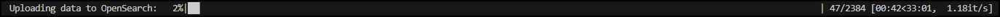
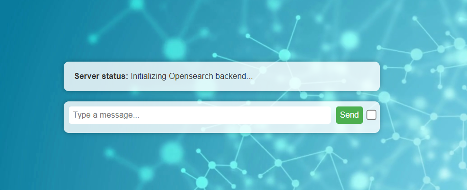
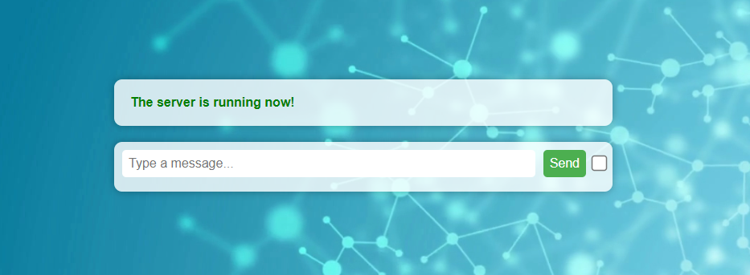
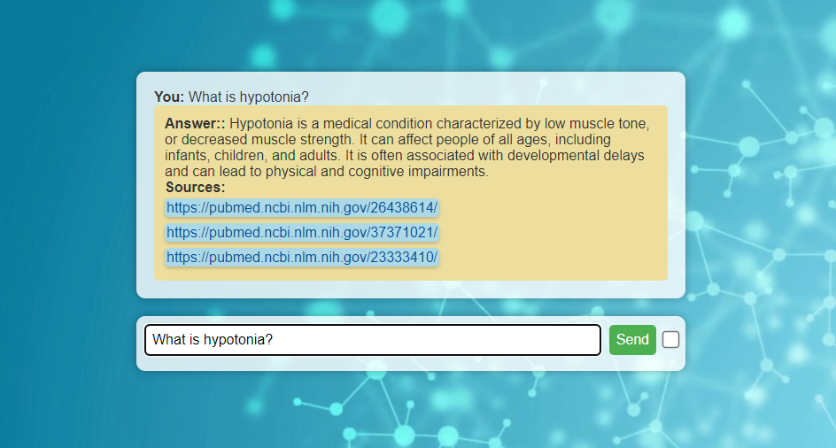
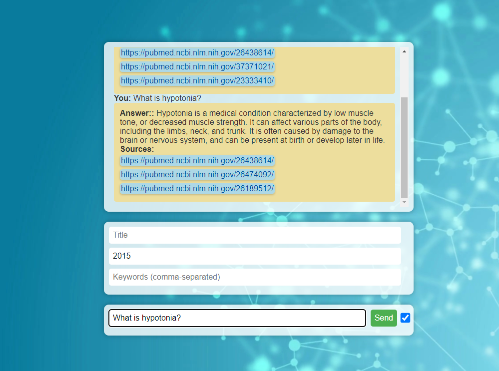
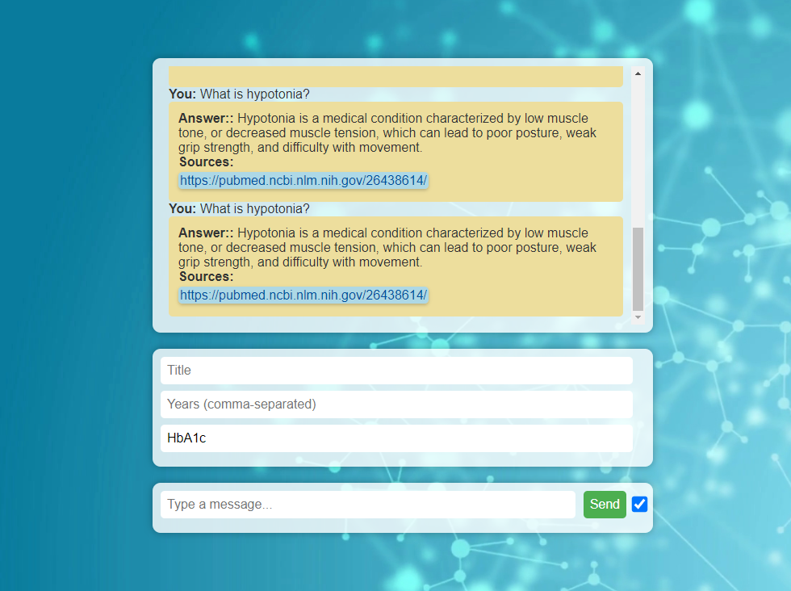

## Installation Instructions 

Please follow the the steps below to setup the infrastructure for the RAG project

1. Install the latest version of [`Docker Desktop`](https://www.docker.com/products/docker-desktop/)
1. Install the required libraries to run the Python script [`data_to_os.py`](data_preprocessing/data_to_os.py) that upload the data to [`OpenSearch`](https://opensearch.org/), the required libraries can be found in [`requirements.txt`](requirements.txt)

    pip install -r requirements.txt

1. Create a folder in [`data_preprocessing`](data_preprocessing) and name it `data` 

1. Copy the data file [`data_embeddings_500_100.csv`](https://1drv.ms/f/s!AgO6RudpYGaRg7k2pyaJ62r_GukU7g?e=aIeKbj) in OneDrive to the folder [`data_preprocessing/data/`](data_preprocessing/data/)

    > The data file is about 5 GB!

1. Copy the file [`config.py`](config.py) to the folder [`app/middleware`](app/middleware/), then edit it and paste the HuggingFace API token in it

    ```Python
    api_tokens = {"HUGGINGFACEHUB_API_TOKEN": "...."}
    ```

    > This is important to access the inference API of [`Falcon-7B-Instruct`](https://huggingface.co/tiiuae/falcon-7b-instruct)

1. Run the [`Docker`](https://www.docker.com/) compose file [`docker-compose.yml`](docker-compose.yml)

    ```Python
    docker compose -f "docker-compose.yml" up -d --build
    ```

    > This might take up to 20 minutes in the first run!

1. Run the Python script [`data_to_os.py`](data_preprocessing/data_to_os.py) to upload the data to [`OpenSearch`](https://opensearch.org/)

    > This step might take 15 to 20 minutes, depending on the speed of the computer.
    > Please make sure the computer is not under heavy load during this step and if it fails please rerun the script again.
    > After a minute, it is expected to see a progress bar as the one below.

    <div style="text-align:center"></div>

1. Open the front-end main webpage [`http://localhost:3000/`](http://localhost:3000/) and wait for the RAG pipeline to be fully initialized

    <div style="text-align:center"></div>

2. Once the initialization is done, you will see that the server is ready

    <div style="text-align:center"></div>

3. Now you can ask the question you want

    <div style="text-align:center"></div>

4. You can also specify filtering options for particular publication years, titles and/or keywords. This can either be done only with one filter for a certain field or with up to 3 filters at the same time. Although, obviously, by specifying a certain title, there will be only one result left:

    <div style="text-align:center"></div>

    <div style="text-align:center"></div>


