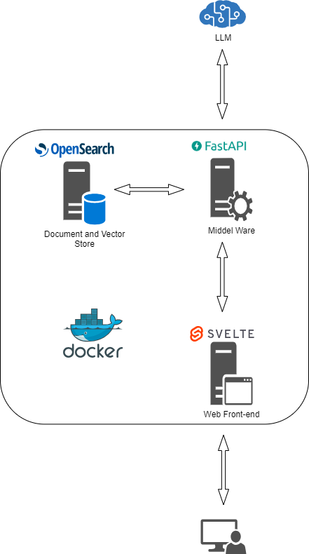

# A RAG-based system for Pubmed

## Table of Contents

  - [Overview](#overview)
  - [Data Preparation](#data-preparation)
    - [Data Collection](#data-collection)
    - [Data Chunking](#data-chunking)
    - [Data Embedding](#data-embedding)
    - [Data Storage](#data-storage)
  - [Information Retrieval](#information-retrieval)
  - [User Interface](#user-interface)
  - [Text Generation](#text-generation)
  - [Evaluation Metrics](#evaluation-metrics)
  - [Test Dataset Generation](#test-dataset-generation)
  - [Contributions](#contributions)
    - [Abdulghani Almasri](#abdulghani-almasri)

## Overview
<div style="text-align:center"></div>

The architecture of the project consists of four components that are containerized in Docker containers and interconnected using Docker internal network that is also accessible using the local host computer. The four components are as follows:

- Front-end web interface to receive user queries
- Middleware powered by FastAPI to retrieve the documents from OpenSearch, filter them, send a prompted question to LLM, process the reply from the LLM and send it back to the user
- OpenSearch for document and vector storage, indexing and retrieval

To the run the project for testing, please follow the steps in the [`installation_instructions.md`](installation_instructions.md)


## Data Preparation

### Data Collection

The traditional [`E-utilities`](https://www.ncbi.nlm.nih.gov/books/NBK25499/) are the usual tool to collect data from [`PubMed`](https://pubmed.ncbi.nlm.nih.gov/) website, but these tools allow a maximum of 10000 records to be retrieved in a search request. On the other hand, the number of the abstracts to be collected for this project is in the range of 59000 and this number of abstracts cannot be downloaded using the traditional tools, therefore we used the [`EDirect`](https://www.ncbi.nlm.nih.gov/books/NBK179288/) tool on the Unix command line as it does not have this limitation. 

Under [`EDirect`](https://www.ncbi.nlm.nih.gov/books/NBK179288/) there are two commands that we used to retrieve the records from [`PubMed`](https://pubmed.ncbi.nlm.nih.gov/),  `esearch` which is used to search for the abstracts within a specific time range and specific keywords, and `efetch` which retrieve the actual records found by `esearch`. 

> We tried to pipeline `efetch` after `esearch` directly to download the records from [`PubMed`](https://pubmed.ncbi.nlm.nih.gov/) but that did not work properly, so we used `esearch` to search for and store the article IDs of all article that have the word `intelligence` in the abstract or in the title of the article as indicated in the project specifications, we then used `efetch` separately to download the articles using the article IDs we collected using `esearch`, in this second stage we excluded any article outside the time range between 2013 and 2023.

[`EDirect`](https://www.ncbi.nlm.nih.gov/books/NBK179288/) commands used to retrieve the article IDs:

```PowerShell
esearch -db pubmed -query "intelligence [title/abstract] hasabstract" | efetch -format uid >articles_ids.csv
```

The article IDs in [`articles_ids.csv`](articles_ids.csv) are then used as an input to the Python script [`retrieve_pubmed_data.py`](data_preprocessing/retrieve_pubmed_data.py) for the actual retrieval of articles, inside this script we used `efetch` in the following format:

 ```Python
 Entrez.efetch(db="pubmed", id=idlist[i:j], rettype='medline', retmode='text')
 ```


### Data Chunking

To comply with the maximum sequence length of both the embedding and the LLM models, and to provide a diverse and granular context, the abstracts had to be chunked into smaller pieces before they are indexed and stored in OpenSearch. We also left an overlap margin between subsequent chunks to keep the context connected and more natural. We experimented with multiple chunk sizes 500, 800 and 100 characters and multiple overlap windows 100, 200 and 250 and we ended up using the chunk size of 500 characters and am overlap windows of 200 as it provided the best retrieval performance compared to the other options. This could be attributed to the fact that smaller chunks can generate more accurate embeddings as the mean pooling is restricted to a shorter list of tokens. 

For chunking, we used `RecursiveCharacterTextSplitter` in [`LangChain`](https://python.langchain.com/docs/modules/data_connection/document_transformers/recursive_text_splitter)

```Python
    # Initialize langChain splitter to split abstracts
    text_splitter = RecursiveCharacterTextSplitter(chunk_size=chunk_size, chunk_overlap=chunk_overlap, separators=["\n\n", "\n", " ", ""])

    # Chunking the abstract with the splitter
    chunks = text_splitter.split_text(str(row['Abstract']))
```

The chunking is done using the script [`data_chunking.py`](data_preprocessing/data_chunking.py) which takes the abstracts we downloaded from [`PubMed`](https://pubmed.ncbi.nlm.nih.gov/), chunk them and save them in a new CSV file.

### Data Embedding

We chose the [`Universal AnglE Embedding`](https://huggingface.co/WhereIsAI/UAE-Large-V1) as our embedding model because it is listed 6th on the [`MTEB Leaderboard`](https://huggingface.co/spaces/mteb/leaderboard) with a retrieval performance close to a much larger models. The size of this model is just 1.34 GB which make it suitable to run locally without the need for any subscription or remote API calls. The model provides two separate embedding options, a standard option to embed the document to be retrieved and a customized option that is augmented with a prompt to generate a query embedding that is more appropriate for retrieval tasks. 

```Python
from angle_emb import AnglE

# Document embedding
angle = AnglE.from_pretrained('WhereIsAI/UAE-Large-V1', pooling_strategy='cls').cuda()
vec = angle.encode('hello world', to_numpy=True)

# Query embedding
angle = AnglE.from_pretrained('WhereIsAI/UAE-Large-V1', pooling_strategy='cls').cuda()
angle.set_prompt(prompt=Prompts.C)
vec = angle.encode({'text': 'hello world'}, to_numpy=True)
```

We created the Python script [`data_embedding.py`](data_preprocessing/data_embedding.py) that takes the CSV file of the chunks we generated in the previous step and generate the embeddings for those chunks and store the output in a new CSV file, we utilized [`Google Colab`](https://colab.google/) for this step as it is requires a GPU to finish in an acceptable time, we repeated this process for the different chunk sizes we experimented with. 


> We have created a new embedding class for [`Universal AnglE Embedding`](https://huggingface.co/WhereIsAI/UAE-Large-V1) model as it is natively supported by [`LangChain`](https://www.langchain.com/), we implemented this new functionality in [`models.py`](app/middleware/models.py).
 
### Data Storage

To store the data with their embeddings in [`OpenSearch`](https://opensearch.org/) we created an index with k-NN enabled and we defined the data types mapping as in the snippet below. 

```yml
    index_mapping = {
        "settings": {
            "index": {
            "knn": True,
            "knn.algo_param.ef_search": 100
            }
        },
        "mappings": {
            "properties": {
                "pmid": {
                    "type": "integer"
                },
                "title": {
                    "type": "text"
                },
                "chunk_id": {
                    "type": "integer"
                },
                "chunk": {
                    "type": "text"
                },
                "year": {
                    "type": "integer"
                },
                "month": {
                    "type": "integer"
                },
                "embedding": {
                    "type": "knn_vector",
                    "dimension": 1024,
                    "method": {
                        "name": "hnsw",
                        "engine": "lucene"
                    }                
                },
                "vector_field": {
                    "type": "alias",
                    "path" : "embedding"
                }
            }
        }
    }
```

We used [`lucene`](https://opensearch.org/docs/latest/search-plugins/knn/knn-index/) as an approximate k-NN library for indexing and search with the method [`hnsw`](https://opensearch.org/docs/latest/search-plugins/knn/knn-index/) for k-NN approximation.

> We created an alias for the vector field to keep using the default name `vector_field` in addition to the customized name we chose `embedding` because [`LangChain`](https://www.langchain.com/) libraries seem to recognize the default name only!


## Information Retrieval

All access to the [`OpenSearch`](https://opensearch.org/) backend is carried out through the [`LangChain`](https://www.langchain.com/) vector store interface [`OpenSearchVectorSearc`](https://api.python.langchain.com/en/v0.0.345/vectorstores/langchain.vectorstores.opensearch_vector_search.OpenSearchVectorSearch.html) in which we used [`Universal AnglE Embedding`](https://huggingface.co/WhereIsAI/UAE-Large-V1) defined in `AnglEModel()` as an embedding function, we also used the default login credentials of [`OpenSearch`](https://opensearch.org/) and disabled any security related messages as they are relevant to our project.


```Python
from langchain_community.vectorstores import OpenSearchVectorSearch

os_store = OpenSearchVectorSearch(
    embedding_function=AnglEModel(),
    index_name=index_name,
    opensearch_url="https://opensearch:9200",
    http_auth=("admin", "admin"),
    use_ssl=False,
    verify_certs=False,
    ssl_assert_hostname=False,
    ssl_show_warn=False,
)
```

Before a vector store can be used by [`LangChain`](https://www.langchain.com/) in the RAG pipeline it has to be wrapped in a retriever object that defines the parameters to be used in the retrieval process such as the number of the top k documents to consider, the text and vector fields in [`OpenSearch`](https://opensearch.org/) index and whether you would like to apply any filters on the retrieved documents based on the meta data. 

```Python
retriever = vector_store.as_retriever(search_kwargs={"k": 3, "text_field":"chunk", "vector_field":"embedding"})
```

We encapsulated the creation of vector store through the helper functions that can be found in the utilities module [`utils.py`](app/middleware/utils.py)

## User Interface

The Frontend Framework consists of two main Svelte files crucial for the operation of a web-based chatbot application. Utilizing [`Svelte`](https://svelte.dev/), a modern frontend compiler, enhances the development experience by offering a simpler and more intuitive syntax compared to traditional frameworks. Unlike frameworks that use a Virtual DOM, Svelte compiles components to highly efficient imperative code that updates the DOM when the state of the application changes. This results in faster initial loads and smoother runtime performance.Svelte provides powerful, yet easy-to-use tools for adding transitions and animations, enhancing the user experience without the need for external libraries. The files are:

[`App.svelte`](app/frontend/src/App.svelte): The main component that serves as the entry point for the application, integrating various components, including the chatbot interface.

[`Chatbot.svelte`](app/frontend/src/Chatbot.svelte): Contains the implementation of the chatbot component, managing the user interface and interaction logic.

### File Descriptions
#### App.svelte
The core component of the application, setting up the layout, styles, and integrating the Chatbot.svelte component. It is crucial for initializing the application and providing a container for the chatbot's functionality.

##### Key Features:
Application layout initialization.
Global styles and themes inclusion.
Integration of the Chatbot.svelte component.

#### Chatbot.svelte
Focuses on the chatbot functionality, including the user interface and interaction logic. It allows for user interaction through message input and displays chatbot responses.

##### Key Features:
User message input field.
Display area for user and chatbot messages.
Logic for processing user input and generating responses.
Getting Started

### Requirements
[`Node.js`](https://nodejs.org/en) (Version 12.x or higher)
[`npm`](https://docs.npmjs.com/) (Node Package Manager)

#### To run this application:
Install Dependencies: In the project root, run npm install to install dependencies.
Run the Application: Execute npm run dev to start the server. Access the app at http://localhost:5000.
Interact with the Chatbot: Use the web interface to communicate with the chatbot.

### Screenshots
Here are some screenshots of the frontend interface to give you a glimpse of what to expect:

## Text Generation

We experimented using multiple large language models like [`Llama 2`](https://huggingface.co/meta-llama), [`OpenAI`](https://openai.com/blog/openai-api), and [`Phi-2`](https://huggingface.co/microsoft/phi-2) using both the local and hosted options, but because of the resource limitations and the requirements for credit cards we ended up using the [`Falcon-7B-Instruct`](https://huggingface.co/tiiuae/falcon-7b-instruct) model because the inference API is free of charge and publicly available on [`HuggingFace`](https://huggingface.co/) without any requirements other that the API token. To access the inference API we can use `HuggingFaceHub` or [`HuggingFaceEndpoint`](https://python.langchain.com/docs/integrations/llms/huggingface_endpoint) interface provided by [`LangChain`](https://www.langchain.com/)

We initialized the model with very low temperature as we are interested in the factual nature of the answer more than its randomness, we also limited the length of the answer to a 500 tokens to keep it more convenient for reading.

```Python    
repo_id = "tiiuae/falcon-7b-instruct" 
llm = HuggingFaceHub(
    repo_id=repo_id, model_kwargs={"temperature": 0.01, "max_new_tokens": 500}
)   
```

> We used the old `HuggingFaceHub` interface instead of the new [`HuggingFaceEndpoint`](https://python.langchain.com/docs/integrations/llms/huggingface_endpoint) because it is still not stable and not working properly

We built a [`LangChain`](https://www.langchain.com/) RAG pipeline using the chain [`RetrievalQA`](https://api.python.langchain.com/en/latest/chains/langchain.chains.retrieval_qa.base.RetrievalQA.html) as in the snippet below:

```Python
# Loads the latest version of RAG prompt
prompt = hub.pull("rlm/rag-prompt", api_url="https://api.hub.langchain.com")

# Initialize langChain RAG pipeline
rag_pipeline = RetrievalQA.from_chain_type(
    llm=llm,
    chain_type="stuff",
    retriever=retriever,
    return_source_documents=True,
    chain_type_kwargs={"prompt": prompt, "verbose":"True"},
    verbose=True    
)
```

As shown above, we used the most up-to-date RAG prompt provided by [`LangChain`](https://www.langchain.com/) that can be downloaded from [`LangChain`](https://www.langchain.com/) hub `rlm/rag-prompt`. We used a `chain_type` of `stuff` to use all the documents retrieved from [`OpenSearch`](https://opensearch.org/) as a context in the answer generation process, in addition to that we configured the RAG pipeline to return the source documents used in the answer generation to use their metadata in following steps like constructing the URLs of the original articles in [`PubMed`](https://pubmed.ncbi.nlm.nih.gov/) that will be provided to the user as sources.


## Evaluation Metrics

Let's have an example to better understand the below mentioned evaluation metrics.
Text generated by the model = "Students enjoy doing NLP homeworks"
Reference text = "Students enjoy doing homeworks"

- ROUGE (Recall-Oriented Understudy for Gisting Evaluation)
    ROUGE-N compares n-grams of the generated text by the model with n-grams of the reference text. N-grams is basically a chunk of n words. ROUGE measues what percent of the words or n-grams in the reference text occur in the generated output. 

    ROUGE-1 measures the overlap of unigrams (individual words) between the generated text and the reference text. 
    ROUGE-1 (recall) is number of matching words / number of words in reference. In our example ROUGE-1 (recall) is 4/4. Because 4 of the words in the generated text appeared in the reference text, that are "Students", "enjoy", "doing", "homeworks". The number of words in the reference text is 4. 
    ROUGE-1 (precision) is number of matching words / number of words in generated text. In our example, that is 4/5. Again we 4 word mathces, but this time we divide it by the number of words in the generated text, that is 5. 
    ROUGE-1 (F1-score) = 2 * ((precision * recall) / (precision + recall)). That is 0.88888888888. 

    ROUGE-2 measures the overlap of bigrams instead of unigrams. 
    ROUGE-2 (recall) is number of matching bigrams / number of bigrams in reference. In our example ROUGE-1 (recall) is 2/3 because there are 2 matching bigrams that are "Students enjoy" and "enjoy doing". 
    ROUGE-2 (precision) is number of matching bigrams / number of bigrams in generated text. In our example, that is 2/4. We have again 2 bigram mathces and we have 4 bigrams in the generated text.
    Finally, ROUGE-2 (F1-score) = 2 * ((precision * recall) / (precision + recall)). That is 0.57142857142. 
    
    As we can see, the ROUGE-2 scores are lower than ROUGE-1 scores. If the texts are long, ROUGE-2 scores will generally be small because bigrams matches will genereally be a few. It is important to report both ROUGE-1 and ROUGE-2 scores and that is what we do in this project.

    ROUGE-L does not compare n-grams. It treats texts as a sequence of words and then looks for the longest common sequence (LCS). A subsequence is a sequence of words that appears in the same relative order. However, those words are not restricted to be coninuous. In our case "Students enjoy doing homeworks" is the longest common subsequence between the generated text and the reference text.
    Its main advantage over ROUGE-1 and ROUGE-2 is that it does not depend on consecutive n-gram mathces as it can be seen from our example. This provides a more accurate capture of sentences. 
    ROUGE-L (recall) is the number of words in longest common subsequence (LCS) / number of words in reference. The LCS is "Students enjoy doing homeworks". The number of words in LCS is 4. So, ROUGE-L (recall) is 4/4
    ROUGE-L (precision) is the number of words in longest common subsequence (LCS) / number of words in generated text. That is 4/5 in our case. 
    ROUGE-L (F1-score) = 2 * ((precision * recall) / (precision + recall)). That is 0.88888888888.


- BLEU (Bilingual Evaluation Understudy)
    BLEU is used to have a single numerical value to a generated text tells how good it is compared to one or more reference texts. BLEU compares n-grams of the generated text to the n-grams of the reference text.
    
    Let's start with uniqrams which correponds to individual words in a text. Again we see that 4 of the words in the generated text appear in the reference text. That are "Students", "enjoy", "doing", "homeworks". 
    The precision or the Unigram Precision is number of matching words / number of words in the generated text. In this case, that is 4/5. The higher precision means a better generation of text. 
    However, a problem that may arise is that repetitive patterns may occur, meaning a word can occur several times resulting in high precision. However, this does not mean that the generated text is good. As an example, if the model generates "homework homework homework homework" the precision gets a perfect score of 1, even the generated text is terribly bad. 
    To handle this issue, BLEU uses a modified precision that clips the number of times to count a specific word based on the number of times it appears in the reference text. In our example, "homework" appears only once in the reference text. So, BLEU clips the number of word mathces to 1 and give the modified unigram precision that is 1/4 (that is much lower than the previous precision as it should be). 
    Another problem is that unigram precision does not pay attention to the order of words. Imagine we have a generated text that is "doing NLP Students homeworks enjoy". In this case, we again get a high score of 4/5 which is not something expected.
    To handle this issue, BLEU actually computes the precision (modified precision) for several n-grams not just unigrams and then reports the results.
    If we calculate the trigram (3-gram) precision for our generated text of "doing NLP Students homeworks enjoy", we get a precision of 0/5 which is something expected. That is because no 3 chunks of words appear in the reference text that we have. So, here the order is considered.

    BLEU calculates unigram, bigram, trigram, 4-gram precision scores and reports individual precision scores and a BLEU Score that is the geometric mean of all four n-gram precisions. BLEU Score is easy to compute and popular but it does not consider meaning and incorporate sentence structure. 

- BERTScore 
    BERTScore is an evaluation metric for text generation that leverages the power of BERT, a pre-trained deep bidirectional   transformers model, to assess the quality of generated text compared to one or more reference texts. Unlike BLEU, which relies on exact matches of n-grams between the generated and reference texts, BERTScore computes semantic similarity using contextual embeddings from BERT. This allows it to capture the meaning of words in context more effectively, addressing some of the limitations of BLEU related to semantic content and sentence structure.

    How BERTScore Works:
    Contextual Embeddings: BERTScore computes the embeddings for each word in the generated text and the reference text(s) using BERT. These embeddings capture the contextual meaning of words, taking into account their surrounding words, which is a significant advantage over traditional n-gram matching.
    Cosine Similarity: For each word in the generated text, BERTScore finds the word in the reference text that has the highest cosine similarity in embedding space. This process is also done in reverse—from the reference text to the generated text—to ensure comprehensiveness.
    Precision, Recall, and F1 Score: BERTScore calculates precision as the average of the highest cosine similarities for each word in the generated text, recall as the average of the highest cosine similarities for each word in the reference text, and the F1 score as the harmonic mean of precision and recall. These scores reflect how well the generated text matches the reference text in terms of semantic similarity, rather than exact word matches.
    Handling Repetition: Since BERTScore is based on semantic similarity rather than counting exact matches, it is inherently more robust to issues of repetition. A text that simply repeats the same word or phrase will not trick the metric into giving a high score, as the overall semantic content and variety will be lacking.
    Sentence Structure: While BERTScore is more sensitive to the meaning of words and phrases than BLEU, it still does not explicitly model sentence structure or grammar. However, the use of deep contextual embeddings means that some aspects of sentence structure are inherently captured in the embeddings, as they reflect the use of words in specific syntactic contexts.

    Advantages of BERTScore:
    Semantic Sensitivity: By using contextual embeddings, BERTScore can assess the semantic content of texts more effectively than metrics based on exact word matches.
    Robustness: It is less susceptible to gaming through repetition or superficial word matches, focusing instead on the overall semantic quality of the text.
    Language Flexibility: BERT and its variants have been pre-trained in multiple languages, making BERTScore applicable to a wide range of languages beyond just English.

## Test Dataset Generation
    Our goal was to generate a testing dataset that contain the following types of questions based on the given abstracts.
    1) Yes/No Questions: these are the questions that essentially require a yes or no answer e.g., “Is Paris the capital of France?”.
    2) Factoid-type Questions [what, which, when, who, how]: These questions usually begin with a “wh”-word. An answer to these questions is commonly short and formulated as a single sentence. In some cases, contents of documents already answers the question, e.g., “What is the capital of France?”, where a sentence from Wikipedia answers the question.
    3) List-type Questions: The answer to this type of questions is a list of items, e.g.,“Which cities have served as the capital of France throughout its history?”. If the exact list of items are already found in documents, answer generation is not necessary. 
    4) Causal Questions [why or how]: Causal questions usually require reasons, explanations, and elaborations on particular objects or events in the answers, e.g., “Why did Paris become the capital of France?”
    5) Hypothetical Questions: These questions describe a hypothetical scenario and usually start with “what would happen if”, e.g., “What would happen if Paris airport closes for a day?”. It is usually hard to get a good accuracy on answering to these questions. In our setting, the answer is usually expected not to be reliable as it is a medical domain.
    6) Complex Questions: These questions ususally reuquire requires multi-part reasoning by understanding the semantics of multiple text snippets or documents to generate a correct answer, e.g., “What cultural and historical factors contributed to the development of the Louvre Museum as a world-renowned art institution?”, which requires taking information from multiple documents into account while generating an answer. -- In our case, we have not implemented generation of these type of questions at this stage of our project because its generation requires finding similarity between multiple documents since taking multiple documents that do not relate each other results in poor questions. However, we consider generation of these question in the next stages of our project.

    Question Generation Process:
    We use the available chunked abstracts of documents from pubmed dataset to generate questions. We make use of prompt engineering and free available api of OpenAI that uses the model "gpt-3.5-turbo-1106" to generate questions from the given abstract.
    We have also tried other freely available models but they do not offer enough rate for our case. So, we had to continue with gpt-3.5-turbo model.
    One of 6 prompts for each question type is used along with a given chunks (chunks in the case of complex questions) to generate questions. With the generated question, an answer to that question is also generated. The result of this prompt should obey the rule of question and answer both being inside of quotation marks as if they are strings. They should be returned as a list of 2 strings. These 2 rules are mentioned a few times in the prompt.

    For questions; Confirmation, Factoid-type, List-type, Causal, Hypothetical, we use the following prompts for each question concatenated to the common prompt that is
    Here are the 5 specific prompt for each type of question.
        prompts = [
            "You to generate a Yes/No question that require an understanding of a given context and deciding a boolean value for an  answer, e.g., 'Is Paris the capital of France?'. ",
            "You need to generate a Factoid-type Question [what, which, when, who, how]: These usually begin with a “wh”-word. An answer then is commonly short and formulated as a single sentence. e.g., 'What is the capital of France?'. ",
            "You need to generate a List-type Question: The answer is a list of items, e.g.,'Which cities have served as the capital of France throughout its history?'. ",
            "You need to generate a Causal Questions [why or how]: Causal questions seek reasons, explanations, and elaborations on particular objects or events, e.g., “Why did Paris become the capital of France?” Causal questions have descriptive answers that can range from a few sentences to whole paragraphs.",
            "You need to generate a Hypothetical Question: These questions describe a hypothetical scenario and usually start with “what would happen if”, e.g., 'What would happen if Paris airport closes for a day?'.",
    ]
    It is important to note that based on the question we select a specific prompt from above and concatenate to the common prompt that is not dependent on question type for the mentioned 5 questions. 
    The common prompt for these questions is below;
    
    "You need to use the given text snippet to generate the question!!. You also need to generate an answer for your question. \
The given text snippet is: " + chunk + " Remember and be careful: each of the entries in the lists should be a string with quotation marks!! " + "You \
just give a python list of size 2 with question and its answer for the given chunk at the end. That is like ['a question', 'an answer to that question']. \
IT IS SOO IMPORTANT TO GIVE ME A LIST OF 2 STRINGS THAT IS QUESTION AND ANSWER!!!"

Complex Question Generation:
- Approach 1:
    For complex questions, we find one or two most similar chunks to the given chunk. 
    We find the most similar chunk(s) as following:
    Each time we take 100 chunks randomly from the processed dataset of chunks and its attributes. Here we make sure that the randomly selected chunks have 4 to 6 keywords. That is because we use 1 to 3 keywords for our similarity search of chunks to generate complex questions in the case of sparse search. As we examined the original processed dataset, we came to a conclusion thaat the more keywords a chunk/abstract has the more generic those keywords are e.g. ... So, we decided to sample from the chunks that have 4-6 keywords for this reason. 
    We divide the sample into 3 parts with the sizes of 40, 40, 20. 
    1) In the first 40 records, we do sparse search with just one keyword.
    2) In the second part that has 40 records, we do the sparse search with two keywords.
    3) In the final part that has 20 records, we do the sparse search with three keywords.

    When we do the dense search for similar chunks, we do not use keywords, but we use the embedding of the chunk to find similar chunks.
    We do the dense search right after we do the sparse search in our iteration over the records. So we go through the same samples of sizes of 40, 40, 20. 
    In the first part of the sample that has 40 records. In the first 30 of those records (75%) we look for the most similar chunk. That applies to both sparse and dense searches. 
    
    Althoug we are looking for the most similar chunk, here we do the search with the size of 2. 
    That is because of the fact that it is perfectly possible to get the chunk itself while we are searching for its similars. If it is the case, we do not consider the chunk itself. If it is not, we take the most similar not considering the remaining similars.
    
    In the remaining part of these records - the remaining 10 (25%), we are searching for the two most similar chunks. Similarly, making the search size 3 because of the possibility of getting the chunk itself as its similar.

    That is the same for the remaining two part of the whole sample with the sizes of 40, 20, respectively. We do the search for the most similar chunk for the 75% of the part, and do search for the two most similar chunks for the 25% of the part. 

    The whole idea of dividing the sample to 3 parts with 40, 40, 20 records, respectively is to get similar chunks with a specific number of keywords (1 keyword, 2 keywords, 3 keywords). That is only for the sparse search and has not effect on dense search. 

    [CONTINUE THE WORK FROM HERE!!]
    Sparse Search: We take 
    
    Here is our prompt [for questions other than complex questions]: 

    prompts[i] + "You need to use the given abstract to generate the question!!. You also need to generate an answer for your question. The abstract is: " + chunk + " Remember and be careful: each of the entries in the lists should be a string with quotation marks!! " + "You just give a python list of size 2 with question and its answer for the given abstract at the end. That is like ['a question', 'an answer to that question']. IT IS SOO IMPORTANT TO GIVE ME A LIST OF 2 STRINGS THAT IS QUESTION AND ANSWER. IF YOU THING THAT THIS KIND OF QUESTION CANNOT BE GENERATED JUST TELL ME 'NA'. DO NOT HALLUSINATE!!!"
    
    Here is our prompt(s) [for complex questions with 2 chunks - a chunk and its most similar chunk]


    In this scenario, prompts[i] is a prompt specific to the question type. Those prompts can be found below:

    prompts = [
            "You to generate a Yes/No question that require an understanding of a given context and deciding a boolean value for an  answer, e.g., 'Is Paris the capital of France?'. ",
            "You need to generate a Factoid-type Question [what, which, when, who, how]: These usually begin with a “wh”-word. An answer then is commonly short and formulated as a single sentence. e.g., 'What is the capital of France?'. ",
            "You need to generate a List-type Question: The answer is a list of items, e.g.,'Which cities have served as the capital of France throughout its history?'. ",
            "You need to generate a Causal Questions [why or how]: Causal questions seek reasons, explanations, and elaborations on particular objects or events, e.g., “Why did Paris become the capital of France?” Causal questions have descriptive answers that can range from a few sentences to whole paragraphs.",
            "You need to generate a Hypothetical Question: These questions describe a hypothetical scenario and usually start with “what would happen if”, e.g., 'What would happen if Paris airport closes for a day?'.",
    ]

    By having a prompt for each question type, we know for sure that which type of question is generated. This is also beneficial in terms of making a prompt as specific as possible. 

    With our prompt, we also consider the case of forcing model to generate a question type that is not necessarily good if generated from a particular abstract. So, we include the case of not generating a question type if it is not suitable from the given abstract. 

    Another aspect that we consider is the format of returned answer from the model, we repetatively mention the format in the prompt. However, we expect the model occassionally return the answer in a different format. That is why we check the format of returned result - checking if the whole answer is a list a of strings. We additionally keep the logs of generated questions that are in a incorrect format. We believe this can give additional insights to improve our implementation of question generations.

    We use PMID's of the documents to know exactly which document a particular question is generated. This is especially useful if we want to run our implementation multiple times as we do not want to generate questions from already processed documents. That is why we keep track of processed documents with the help of their PMID's. 

    We store PMID of the abstract, abstract, question type, question and its answer in a csv file.
    
- Approach 2
    The gen_complex.py script is designed to generate complex questions based on pairs of scientific abstracts with overlapping keywords. It utilizes the OpenAI GPT-3.5 API to create questions that require understanding the semantics of both abstracts. The process involves reading abstracts from a CSV file, identifying pairs with a significant number of common keywords, and then using these pairs to generate questions aimed at testing comprehension and reasoning abilities.

    Key Features:
    Safe Literal Evaluation: Safely evaluates strings to Python literals, ensuring that malformed strings are handled gracefully.
    Complex Question Generation: Leverages GPT-3.5 model to formulate complex questions that require multi-part reasoning, enhancing the depth of understanding required to answer.
    Pair Extraction Based on Keywords: Identifies abstract pairs with a substantial overlap in keywords, indicating potential thematic or semantic connections.

    How It Works:
    Reading Data: The script reads abstracts and their associated keywords from a specified CSV file.
    Identifying Unique Pairs: It identifies unique pairs of abstracts with more than 15 common keywords, suggesting a meaningful connection between them.
    Generating Questions: For each identified pair, the script generates a complex question by synthesizing the content of both abstracts.
    Output: The generated questions and their corresponding abstract pairs are saved to an output CSV file for further use.

    Usage:
    Set your OpenAI API key in the script.
    Specify the input CSV file path containing the abstracts and keywords.
    Define the output CSV file path where the generated questions will be saved.
    Run the script to produce a dataset of complex questions based on scientific abstracts.
  

    [TALK ABOUT API LIMITATIONS IN SOMEWHERE HERE]

## Contributions

### Abdulghani Almasri

1. Collecting abstracts from [`PubMed`](https://pubmed.ncbi.nlm.nih.gov/) for the years between 2013 and 2023 that have the word `intelligence` in the abstract or in the title using [`EDirect`](https://www.ncbi.nlm.nih.gov/books/NBK179288/).
2. Chunking data with [`LangChain`](https://python.langchain.com/docs/modules/data_connection/document_transformers/recursive_text_splitter) `RecursiveCharacterTextSplitter` and experimenting with information retrieval from OpenSearch using different chunk sizes, 500, 800 and 1100 characters.
3. Embedding data chunks with [`Universal AnglE Embedding`](https://huggingface.co/WhereIsAI/UAE-Large-V1) model using [`Google Colab`](https://colab.google/).
4. Setting up [`OpenSearch`](https://opensearch.org/) and [`OpenSearch Dashboards`](https://opensearch.org/docs/latest/dashboards/) [`Docker`](https://www.docker.com/) containers, and creating the [`k-NN`](https://opensearch.org/docs/latest/search-plugins/knn/index/) index for vector storage.
5. Extending [`LangChain`](https://www.langchain.com/) embedding functions with a new class that wrap the [`Universal AnglE Embedding`](https://huggingface.co/WhereIsAI/UAE-Large-V1) model so it can be used in the RAG pipeline, as in [`models.py`](app/middleware/models.py).
6. Creating helper functions that are used to initialize the language model, initialize the vector store, build the URLs of the source articles and process the answer received from the language model, as in [`utils.py`](app/middleware/utils.py).
7. Creating the RAG pipeline with the most recent RAG prompt from [`LangChain`](https://www.langchain.com/), setting up the retriever with the proper parameters and experimenting with the metadata of the returned source documents.
8. Experimenting with multiple language models like [`Llama 2`](https://huggingface.co/meta-llama) and [`Falcon-7B-Instruct`](https://huggingface.co/tiiuae/falcon-7b-instruct) to find the model that we can use in our project.
9. Adding the documentation for the tasks mentioned above in [`readme.md`](readme.md) and the how-to instructions in [`installation_instructions.md`](installation_instructions.md), and creating the high-level diagram of the project.